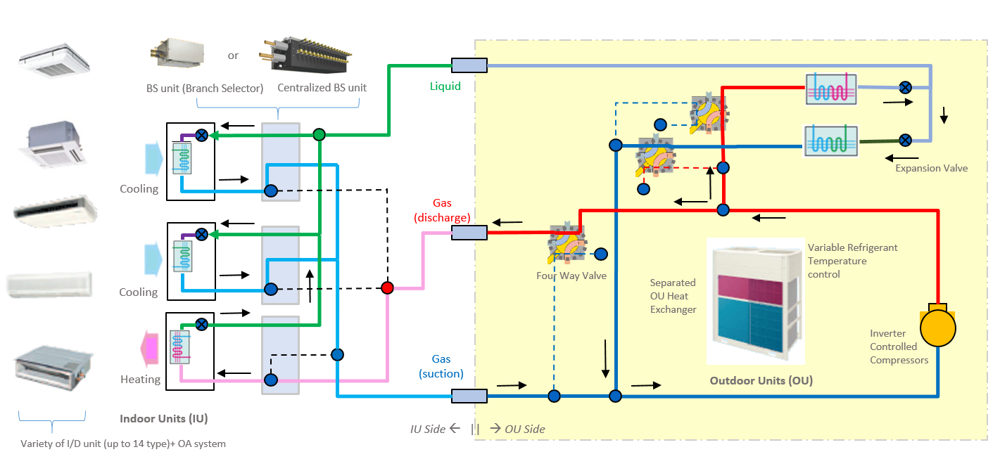
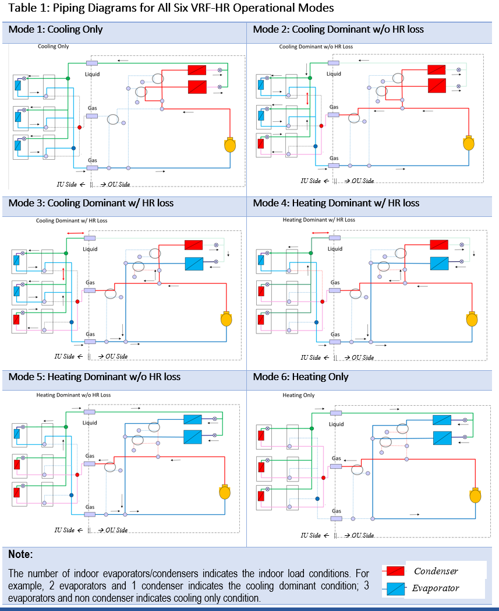
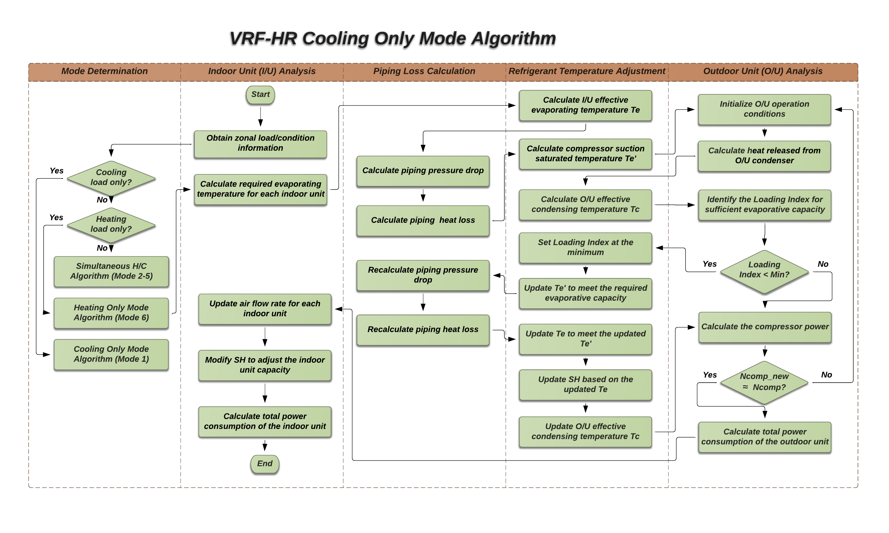
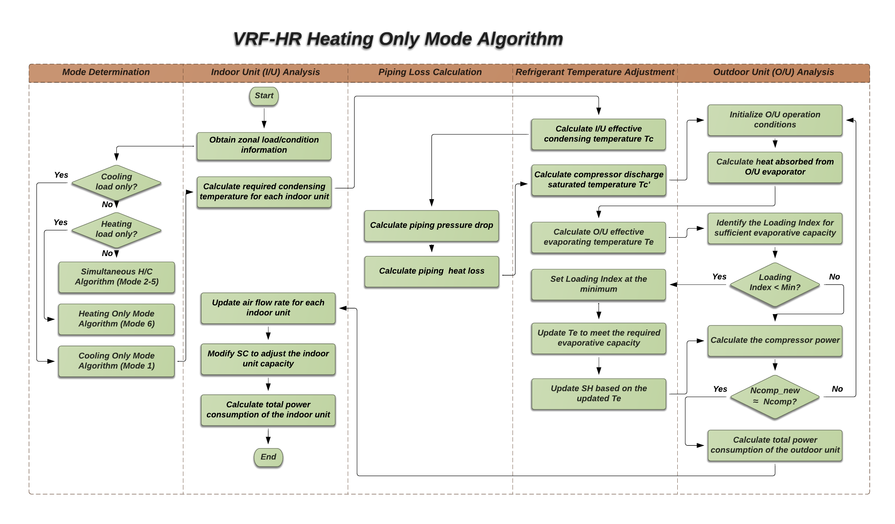
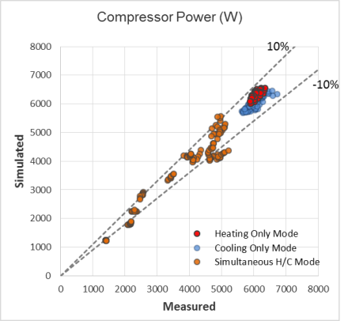

A New VRF Heat Recovery System Model
================

 **Rongpeng Zhang, Tianzhen Hong.**
 **Lawrence Berkeley National Laboratory**

 - Original Date: Jan. 16, 2016
 - Revision Date: Mar. 20, 2016
 

## Justification for New Feature ##

The proposed new feature introduces an innovative model to simulate the energy performance of Variable Refrigerant Flow (VRF) systems with heat recovery (HR) configurations, which is capable of achieving heat recovery from cooling zones to heating zones and providing cooling and heating operation simultaneously. This feature is a continuation of the new VRF heat pump (HP) system model implemented in EnergyPlus V8.4.

The proposed model is developed for the 3-pipe VRF-HR systems, the dominant system configuration in the current VRF-HR market. Compared with the VRF-HP system, VRF-HR is more complicated in terms of system configuration and operational controls. To enable simultaneous cooling and heating, complex refrigerant management loop and more system components are implemented, including one more heat exchanger in the outdoor unit (OU) and multiple Branch Selector (BS) Units. The two outdoor heat exchangers can work at different combinations of evaporator/condenser mode to handle diverse and changing indoor heating/cooling load requirements. This leads to varying refrigerant flow directions and different control logics for various operational modes, and therefore specific algorithm is needed for separate major operational modes.

The proposed new VRF-HR model inherits many key features of the recently implemented VRF-HP model. Compared with the existing system curve based VRF-HR model, the new model is more physics-based by simulating the refrigerant loop performance. It is able to consider the dynamics of more operational parameters, which is essential for the representation of the complex control logics (e.g., the adjustment of superheating degrees during low load operations). Furthermore, the proposed model implements component-level curves rather than the system-level curves, and thus requires much fewer curves as model inputs. These features considerably extend the modeling capabilities of the new VRF-HR model, including:

-	Allowing more accurate estimations of HR loss, a critical parameter in the VRF-HR operations.
-	Allowing variable evaporating and condensing temperatures in the indoor and outdoor units under a variety of operational conditions.
-	Allowing implementation of various control logics for different VRF-HR operational modes.
-	Allowing further modifications of operational parameters (e.g., evaporating temperature and superheating degrees) during low load conditions.
-	Allowing variable fan speed based on the temperature and zone load in the indoor units (IU).
-	Allowing an enhanced physics-based model to calculate piping loss in the refrigerant piping network (varies with refrigerant flow rate, operational conditions, pipe length, and pipe and insulation materials) instead of a constant correction factor. 
-	Allowing the potential simulation of demand response of VRF systems by directly slowing down the speed of compressors in the outdoor units with inverter technology.


## E-mail and  Conference Call Conclusions ##

•	Brent, Jan. 20. 2016

-	Comments:
This looks interesting.  I have no problems with the overall approach.  
It seems to me after studying Figure 3 that there might be a reason to organize it as having 12 modes, each of your 6 modes with and without the low load modification.
-	Reply:
You are right that every operational mode may have two sub-modes: with and without the low load modification. That will affect the operational conditions such as evaporating temperature levels, but will not change the system configurations, i.e., the piping connections and the refrigerant flow directions. So, it may not be quite necessary to increase the mode number from 6 to 12 just for the low load modifications. 
We defined the 6 operational mode mainly depending on the different system configurations. We tried to keep the mode number low to make the algorithm clear and concise, but are these six modes are so different that we cannot combine them. We have to develop specific algorithm for each of them.

•	Richard, Jan. 20. 2016

-	Comments:
1) I don't believe all manufacturers use a split condenser configuration. How will you model single coil condensers?
2) How will you know when to provide heating and cooling with (mode 3) and W/O HR mode (mode 2)?
3) Is there enough information about the piping system to accurately model piping losses?
-	Reply:
(1) It seems most current VRF-HR systems implement two OU heat exchangers to support enhanced control strategy. Not sure how widely used the single heat exchange systems are. I will double check with our manufacturer partner. Probably we will only handle the dominant system configurations in the market for now.
(2) The operational mode is determined by the algorithm, not the user, based on the load requirements and operational conditions. We have developed a specific HR loss calculation method making use of the refrigerant loop information. This plays a key role in the mode determinations. More details will be included in DD.
(3) The piping loss calculations in VRF-HR are similar to those in the VRF-HP model. The information it requires (including main pipe length, equivalent length, diameter, and insulation) can usually be obtained from the system engineering manual.

•	Jason Glazer, Jan. 27. 2016

-	Comments:
It would be great if either a user input or at least an output would show the ARHI Simultaneous Cooling and Heating Efficiency (SCHE) rating condition as described in AHRI 1230 and any other figures of merit that are unique for heat recovery VRF systems. Outputs of the rated IEER would be good too. 
-	Reply:
Good suggestions. We will ourput this key parameter for HR operations.

•	Bereket Nigusse, Jan. 27. 2016

-	Comments:
The VRF model description and the schematic diagram provided are for 3-pipe VRF-HR system.  Some VRF manufacturers use a 2-pipe VRF-HR system design. Have you considered the 2-pipe VRF-HR system model? 
-	Reply:
The new VRF HR model is for 3-pipe systems, which is the dominant system configuration in the VRF-HR market. Most VRF manufacturers adopt 3-pipe configuration (e.g., Daikin, Samsung, Carrier, LG, Toshiba, etc; except for Mitsubishi). The 2-pipe and 3-pipe systems are very different in terms of refrigerant loop operations, piping connections and control logic, so they cannot be covered by a generic physics based model. Currently we don't have resource to add a 2-pipe VRF HR model (a very expensive process to cover algorithm development, EnergyPlus implementation, obtaining measured data, and model validation). We will document this (current model for 3-pipe system) clearly in the EnergyPlus IORef and EngRef.


## Overview ##

The VRF-HR system has more complicated configurations than the VRF-HP system. Figure 1 shows the schematic chart of a 3-pipe VRF-HR system, a dominant system configuration in the VRF-HR market. As can be seen in the figure, there are two heat exchangers in the outdoor unit. They can work at different evaporator/condenser combinations to generate specific operational modes. Also note that there are a number of Four-Way Directional Valves (FWV) and Branch Selector (BS) Units in the system, which are used to create separate refrigerant piping connections for different operational mode. These features allow the system to provide simultaneous heating/cooling to address diverse space conditioning situations.


Figure 1. Schematic chart of a 3-pipe VRF-HR system

Depending on the indoor cooling/heating requirements and the outdoor unit operational states, the operations of the VRF-HR system can be divided into six modes:
-	Mode 1: Cooling load only. No heating load. Both OU heat exchangers perform as condensers.
-	Mode 2: Simultaneous heating and cooling. The sum of cooling loads and compressor heat is much larger than the heating loads. Both OU heat exchangers perform as condensers.
-	Mode 3: Simultaneous heating and cooling. The sum of cooling loads and compressor heat is slightly larger than the heating loads. One OU heat exchanger perform as condenser while the other performs as evaporator.
-	Mode 4: Simultaneous heating and cooling. The sum of cooling loads and compressor heat is slightly smaller than the heating loads. One OU heat exchanger perform as condenser while the other performs as evaporator.
-	Mode 5: Simultaneous heating and cooling. The sum of cooling loads and compressor heat is much smaller than the heating loads. Both OU heat exchangers perform as evaporators.
-	Mode 6: Heating load only. No cooling load. Both OU heat exchangers perform as evaporators.

The system-level heat balance diagram for all the six operational modes are shown Figure 2.


Figure 2. System-level Heat Balance Diagram for All VRF-HR Operational Modes

With the help of FWV and BS units, every operational mode has its own refrigerant piping connections to achieve different refrigerant flow directions, as shown in Table 1. This leads to different refrigerant operations (HP charts shown in Table 2) and piping loss situations. The operational control logics for various modes are also different, and therefore particular algorithm needs to be designed for different operational modes in the new VRF-HR model.

 


The implementation of the proposed VRF HR algorithm will go to the method “HVACVariableRefrigerantFlow::CalcVRFCondenser_FluidTCtrl”, which was newly added in V8.4 particularly for the VRF-FluidTCtrl-HP model. Therefore, the implementation of the new VRF-HR feature is expected to generate no or little impacts on other parts of the codes. 


Figure 3. Coding Hierarchy of the VRF model in the current EnergyPlus V8.4


## Approach ##

The holistic logics of the new VRF-HR model are illustrated in Figure 4 to show the key simulation steps for different operational modes. More detailed calculation procedures are described in the following sections. Note that the algorithms of the VRF-HR Cooling Only Mode and Heating Only Mode are the same as those in the VRF-HP Cooling Mode and Heating Mode, respectively. Therefore, this section will only focus on the description of the algorithm for VRF-HR Simultaneous Heating and Cooling Mode.


(a) Cooling Only Mode 

(b) Heating Only Mode 

(c) Simultaneous Heating and Cooling Mode

Figure 4. Schematic chart of the new VRF-HR algorithm


##### Step 1: Obtaining zonal load/condition information

Obtain the following information for each zone from the zone modules within EnergyPlus: 

* zone sensible loads <span>$Q_{in, sensible}$</span>

* zone total loads <span>$Q_{in, total}$</span>

* indoor air temperature <span>$T_{in}$</span>

* indoor air humidity ratio <span>$W_{in}$</span>

If there is only cooling load and no heating load, go to the VRF-HR Cooling Only Mode, the algorithms of which is the same as those for the VRF-HP Cooling Mode. If there is only heating load and no cooling load, go to the VRF-HR Heating Only Mode, the algorithms of which is the same as those for the VRF-HP Heating Mode. Otherwise, go to the VRF-HR Simultaneous Heating and Cooling Mode as described below.

##### Step 2: Calculate I/U required evaporating temperature and/or the condensing temperature 
Evaluate the required coil surface air temperature <span>$T_{fs}$</span> and then the required evaporator refrigerant temperature <span>$T_{e,req}$</span> for each indoor unit with cooling requirements. Likewise, evaluate the required condenser refrigerant temperature <span>${T_{c,req}}$</span> for each indoor unit with heating requirements.
(Refer to Engineering Reference V8.4+: Step 1.2 in the VRF-FluidTCtrl-HP model for more details.)

##### Step 3: Calculate I/U effective evaporating temperature Te and/or the condensing temperature Tc
There are two refrigerant temperature control strategies for the indoor unit: (1) *ConstantTemp*, (2) *VariableTemp*.
 - In the *ConstantTemp* strategy, <span>$T_e$</span> and <span>$T_c$</span> are kept at constant values provided by the user.
 - In the *VariableTemp* strategy, <span>$T_e$</span> and <span>$T_c$</span> are determined using the required evaporating/condensing temperature calculated in Step 2.
(Refer to Engineering Reference V8.4+: Step 1.3 in the VRF-FluidTCtrl-HP model for more details.)

##### Step 4: I/U condenser side piping loss calculations

This section calculates the I/U condenser side piping loss, which occurs at the High and Low Pressure Gas Pipe where the refrigerant flowing from the O/U compressor outlets to the I/U condensers. It includes both the refrigerant pressure drop <span>$\Delta{P_{pipe}}$</span> and heat loss <span>$Q_{pipe}$</span>. Note that the change of compressor operational conditions may lead to different control strategies of the system, which in reverse affects the amount of piping loss. So the piping loss analysis and system performance analysis are coupled together. Numerical iterations are designed to address the coupling effect.

In this step, the compressor discharge saturated temperature <span>$T'_c$</span> (i.e., saturated vapor temperature corresponding to compressor discharge pressure) can be obtained using the calculated refrigerant pressure drop <span>$\Delta{P_{pipe}}$</span>.
(Refer to Engineering Reference V8.4+: Step 2h.1 in the VRF-FluidTCtrl-HP model for more details.)

##### Step 5: I/U evaporator side piping loss calculations

This section calculates the I/U evaporator side piping loss, which occurs at Suction Gas Pipe where the refrigerant flowing from the I/U evaporators to the O/U compressor inlets. Similarly to the I/U condenser side piping loss, it includes both the refrigerant pressure drop <span>$\Delta{P_{pipe}}$</span> and heat loss <span>$Q_{pipe}$</span>. 

In this step, the compressor suction saturated temperature <span>$T'_e$</span> (i.e., saturated vapor temperature corresponding to compressor suction pressure) can be obtained using the calculated refrigerant pressure drop <span>$\Delta{P_{pipe}}$</span>.

Note that one key input of the I/U evaporator side piping loss calculations is the enthalpy of the refrigerant at I/U evaporator inlets. It is assumed to be equal to the average enthalpy of the refrigerant at I/U condenser outlets, which is obtained in the I/U condenser side piping loss calculations.
(Refer to Engineering Reference V8.4+: Step 2c.1 in the VRF-FluidTCtrl-HP model for more details.)

##### Step 6: Determine the operational mode for simultaneous heating and cooling operations

As noted earlier, simultaneous heating and cooling operations include the following modes:
-	Mode 2: Cooling dominant w/o HR loss
-	Mode 3: Cooling dominant w/ HR loss
-	Mode 4: Heating dominant w/ HR loss
-	Mode 5: Heating dominant w/o HR loss

This section determines the operational mode based on the load requirements and operational conditions:

a. Calculate the Loading Index LI_1 satisfying I/U cooling load (Refer to Engineering Reference V8.4+: Step 2c.4 in the VRF-FluidTCtrl-HP model for more details.)

b. Calculate the Loading Index LI_2 satisfying I/U heating load (Refer to Engineering Reference V8.4+: Step 2h.4 in the VRF-FluidTCtrl-HP model for more details.)

c. If LI_1 <= LI_2, the system operates at Mode 5

d. If LI_1 > LI_2 and Te' < To - 5, the system operates at Mode 2

e. If LI_1 > LI_2 and Te' >= To - 5, the system operates at Mode 3 or 4 (these two modes can be handled by one set of algorithms)


##### Step 7-A: O/U operation analysis at Mode 5

** If Te' < To - 5, perform the following procedures: **

a. Select the compressor speed corresponding to LI_2

b. Calculate the compressor power corresponding to LI_2 and the previously obtained Tc and Te'
(Refer to Engineering Reference V8.4+: Step 2c.6 in the VRF-FluidTCtrl-HP model for more details.)

c. Calculate the evaporative capacity (Cap_tot_evap) provided by the compressor at LI_2 and the previously obtained Tc and Te'
(Refer to Engineering Reference V8.4+: Step 2c.4 in the VRF-FluidTCtrl-HP model for more details.)

d. Calculate the O/U evaporator load (Cap_ou_evap) based on system-level heat balance

e. Obtain the O/U fan flow rate (m_air_evap) corresponding to Cap_ou_evap, and thus the fan power
(Refer to Engineering Reference V8.4+: Step 2c.3 in the VRF-FluidTCtrl-HP model for more details.)

** If Te' >= To - 5, perform the following procedures: **

a. Select the compressor speed corresponding to LI_1

b. Perform iterations between step b-i to identify the compressor Loading Index and power consumption.

c. Initialized compressor power (Ncomp_ini)

c.1 For the 1st iteration step, calculate Ncomp = f_pow_comp(Tc, Tout – 5, LI_2)

c.2 For the following iteration steps, update Ncomp = (Ncomp_ini + Ncomp_new)/2

d. Calculate the O/U evaporator load (Cap_ou_evap) based on system-level heat balance

e. Obtain the O/U evaporating temperature Te' level using Cap_ou_evap and the rated air flow rate
(Refer to Engineering Reference V8.4+: Step 2c.3 in the VRF-FluidTCtrl-HP model for more details.)

f. Update Te level and I/U evaporator side piping loss, corresponding to Te' update

g. Identify the compressor Loading Index LI_new to provide sufficient evaporative capacity (Cap_tot_evap) at updated Te' level
(Refer to Engineering Reference V8.4+: Step 2c.4 in the VRF-FluidTCtrl-HP model for more details.)

h. Calculate the compressor power (Ncomp_new) corresponding to LI_new and the updated Te'
(Refer to Engineering Reference V8.4+: Step 2c.6 in the VRF-FluidTCtrl-HP model for more details.)

i. Compare Ncomp_new and Ncomp_ini. Start a new round of iteration if the difference is greater than the tolerance.

##### Step 7-B: O/U operation analysis at Mode 2

a. Select the compressor speed corresponding to LI_1

b. Calculate the compressor power corresponding to LI_1 and the previously obtained Tc and Te'
(Refer to Engineering Reference V8.4+: Step 2c.6 in the VRF-FluidTCtrl-HP model for more details.)

c. Calculate the evaporative capacity (Cap_tot_evap) provided by the compressor at LI_1 and the previously obtained Tc and Te'
(Refer to Engineering Reference V8.4+: Step 2c.4 in the VRF-FluidTCtrl-HP model for more details.)

d. Calculate the O/U condenser load (Cap_ou_cond) based on system-level heat balance

e. Obtain the O/U fan flow rate (m_air_cond) corresponding to Cap_ou_cond, and thus the fan power

##### Step 7-C: O/U operation analysis at Mode 3 or 4

a. Select the compressor speed corresponding to LI_1

b. Perform iterations between step b-e to identify the updated Te' level within the range of To-5 and the original Te'.

c. Calculate the evaporative capacity (Cap_tot_evap) provided by the compressor at LI_1 and the previously obtained Tc and assumed Te'
(Refer to Engineering Reference V8.4+: Step 2c.4 in the VRF-FluidTCtrl-HP model for more details.)

d. Calculate the O/U evaporator load (Cap_tot_evap) at assumed Te' level and rated fan flow rate
(Refer to Engineering Reference V8.4+: Step 2h.3 in the VRF-FluidTCtrl-HP model for more details.)

e. Perform iterations to identify the updated Te' level to ensure the heat balance for the b. and c. calculations

f. Update Te level and I/U evaporator side piping loss, corresponding to Te' update

g. Calculate the compressor power corresponding to LI_1 and the updated Te'
(Refer to Engineering Reference V8.4+: Step 2c.6 in the VRF-FluidTCtrl-HP model for more details.)

h. Calculate the O/U condenser load (Cap_ou_cond) based on system-level heat balance

i. Obtain the O/U fan flow rate (m_air_cond) corresponding to Cap_ou_cond, and thus the fan power

##### Step 8: Modify I/U operational parameters for capacity adjustments
The air flow rate and SH/SC value of each indoor unit can be manipulated to adjust the cooling/heating capacity.
(Refer to Engineering Reference V8.4+: Step 3c and 3h in the VRF-FluidTCtrl-HP model for more details.)


## Testing/Validation/Data Sources ##

The model is validated with Daikin laboratory measurement data on a typical 3-pipe VRF Heat Recovery Multi-Split System. The system employs two inverter controlled compressors and one fixed speed compressor, which can work jointly to vary the compressor operation mode for a variety of operational conditions. Five terminal units are installed to create numerous heating/cooling load combinations. Comprehensive measurement data was collected for 14 static condition cases, covering the cooling only mode, heating only mode, and mostly the simultaneous heating and cooling mode. The sensible and latent load (latent capacity only used in cooling mode) in each indoor unit are calculated using the measurement data, and then given to the simulation as the zone load using the schedule object and other equipment object. The simulated compressor performance is then compared with the measured data. As shown in Figure 5, the simulated compressor speed and power using the new VRF-HR model can present a satisfactory match with the measured data throughout all the operational modes at sub-hour levels.


(a) Compressor power (sub-hourly)

(b) Compressor speed (sub-hourly)

Figure 5. Comparison of the measured and simulated compressor data under various operational modes


## Input Output Reference Documentation ##

To be developed.


## IDD Objects (New) ##

We propose to create a new IDD object named "AirConditioner:VariableRefrigerantFlow:FluidTemperatureControl:HR", which is an extension of the existing "AirConditioner:VariableRefrigerantFlow:FluidTemperatureControl" object designed for the VRF-FluidTCtrl-HP model.

```
AirConditioner:VariableRefrigerantFlow:FluidTemperatureControl,
       \memo This is a key object in the new physics based VRF model applicable for Fluid
       \memo Temperature Control
       \memo It describes the Variable Refrigerant Flow system excluding the performance of indoor units
       \memo Indoor units are modeled separately, see ZoneHVAC:TerminalUnit:VariableRefrigerantFlow
       \min-fields 9
  A1 , \field Heat Pump Name
       \required-field
       \type alpha
       \note Enter a unique name for this variable refrigerant flow heat pump
  A2 , \field Availability Schedule Name
       \type object-list
       \object-list ScheduleNames
       \note Enter the name of a schedule that defines the availability of the unit
       \note Schedule values of 0 denote the unit is off. All other values denote the unit is available
       \note If this field is left blank, the unit is available the entire simulation
  A3 , \field Zone Terminal Unit List Name
       \required-field
       \type object-list
       \object-list ZoneTerminalUnitListNames
       \note Enter the name of a ZoneTerminalUnitList. This list connects zone terminal units to this
       \note heat pump
  A4 , \field Refrigerant Type
       \type object-list
       \object-list FluidNames
       \default R410A
  N1 , \field Rated Evaporative Capacity
       \type real
       \units W
       \minimum> 0.0
       \default 40000
       \note Enter the total evaporative capacity in watts at rated conditions
       \note This is the capacity corresponding to the max compressor speed at rated conditions
       \note The actual evaporative capacity is obtained by multiplying the
       \note rated capacity with the modification factor calculated by Evaporative
       \note Capacity Multiplier Function of Temperature Curve
  N2 , \field Rated Compressor Power Per Unit of Rated Evaporative Capacity
       \type real
       \units dimensionless
       \minimum> 0.0
       \default 0.35
       \note Enter the rated compressor power per Watt of rated evaporative capacity [W/W]
       \note Rated compressor power corresponds to the max compressor speed at rated conditions
       \note The actual compressor power is obtained by multiplying the
       \note rated power with the modification factor calculated by Compressor
       \note Power Multiplier Function of Temperature Curve
  N3 , \field Minimum Outdoor Air Temperature in Cooling Only Mode
       \type real
       \units C
       \default -6.0
       \note Enter the minimum outdoor temperature allowed for cooling operation
       \note Cooling is disabled below this temperature
  N4 , \field Maximum Outdoor Air Temperature in Cooling Only Mode
       \type real
       \units C
       \default 43.0
       \note Enter the maximum outdoor temperature allowed for cooling operation
       \note Cooling is disabled above this temperature
  N5 , \field Minimum Outdoor Air Temperature in Heating Only and Simultaneous H/C Mode
       \type real
       \units C
       \default -20.0
       \note Enter the minimum outdoor temperature allowed for heating operation
       \note Heating is disabled below this temperature
  N6 , \field Maximum Outdoor Air Temperature in Heating Only and Simultaneous H/C Mode
       \type real
       \units C
       \default 16.0
       \note Enter the maximum outdoor temperature allowed for heating operation
       \note Heating is disabled below this temperature
  N7 , \field Reference Outdoor Unit Superheating
       \type real
       \units deltaC
       \default 3
  N8 , \field Reference Outdoor Unit Subcooling
       \type real
       \units deltaC
       \default 5
  A5 , \field Refrigerant Temperature Control Algorithm for Indoor Unit
       \type choice
       \key ConstantTemp
       \key VariableTemp
       \default VariableTemp
  N9 , \field Reference Evaporating Temperature for Indoor Unit
       \note This field is used if Refrigerant Temperature Control Algorithm
       \note is ConstantTemp
       \note Evaporating temperature is the refrigerant temperature, not air temperature
       \type real
       \units C
       \default 6.0
  N10, \field Reference Condensing Temperature for Indoor Unit
       \note This field is used if Refrigerant Temperature Control Algorithm
       \note is ConstantTemp
       \note Condensing temperature is the refrigerant temperature, not air temperature
       \type real
       \units C
       \default 44.0
  N11, \field Variable Evaporating Temperature Minimum for Indoor Unit
       \note This field is used if Refrigerant Temperature Control Algorithm
       \note is VariableTemp
       \note Evaporating temperature is the refrigerant temperature, not air temperature
       \type real
       \units C
       \default 4.0
  N12, \field Variable Evaporating Temperature Maximum for Indoor Unit
       \note This field is used if Refrigerant Temperature Control Algorithm
       \note is VariableTemp
       \note Evaporating temperature is the refrigerant temperature, not air temperature
       \type real
       \units C
       \default 13.0
  N13, \field Variable Condensing Temperature Minimum for Indoor Unit
       \note This field is used if Refrigerant Temperature Control Algorithm
       \note is VariableTemp
       \note Condensing temperature is the refrigerant temperature, not air temperature
       \type real
       \units C
       \default 42.0
  N14, \field Variable Condensing Temperature Maximum for Indoor Unit
       \note This field is used if Refrigerant Temperature Control Algorithm
       \note is VariableTemp
       \note Condensing temperature is the refrigerant temperature, not air temperature
       \type real
       \units C
       \default 46.0
  N15, \field Outdoor Unit Fan Power Per Unit of Rated Evaporative Capacity
       \note Enter the outdoor unit fan power per Watt of rated evaporative capacity [W/W]
       \units dimensionless
       \minimum> 0.0
       \default 4.25E-3
       \type real
  N16, \field Outdoor Unit Fan Flow Rate Per Unit of Rated Evaporative Capacity
       \note This field is only used if the previous is set to autocalculate and performance input method is NominalCapacity
       \units m3/s-W
       \minimum> 0.0
       \default 7.50E-5
       \type real
  A6 , \field Outdoor Unit Evaporating Temperature Function of Superheating Curve Name
       \required-field
       \type object-list
       \object-list QuadraticCurves
       \object-list UniVariateTables
  A7 , \field Outdoor Unit Condensing Temperature Function of Subcooling Curve Name
       \required-field
       \type object-list
       \object-list QuadraticCurves
       \object-list UniVariateTables
  N17, \field Diameter of Suction Gas Pipe
       \note used to calculate the piping loss
       \type real
       \units m
       \minimum 0.0
       \default 0.0762
  N17, \field Diameter of High and Low Pressure Gas Pipe
       \note used to calculate the piping loss
       \type real
       \units m
       \minimum 0.0
       \default 0.0762
  N18, \field Length of Main Pipe Connecting Outdoor Unit to Indoor Units
       \note used to calculate the heat loss of the main pipe
       \type real
       \units m
       \minimum 0.0
       \default 30.0
  N19, \field Equivalent Length of Main Pipe Connecting Outdoor Unit to Indoor Units
       \note used to calculate the refrigerant pressure drop of the main pipe
       \type real
       \units m
       \minimum 0.0
       \default 36.0
  N20, \field Height Difference Between Outdoor Unit and Indoor Units
       \note Difference between outdoor unit height and indoor unit height
       \note Positive means outdoor unit is higher than indoor unit
       \note Negative means outdoor unit is lower than indoor unit
       \type real
       \units m
       \default 5.0
  N21, \field Main Pipe Insulation Thickness
       \type real
       \units m
       \minimum 0.0
       \default 0.02
  N22, \field Main Pipe Insulation Thermal Conductivity
       \type real
       \units W/m-K
       \minimum 0.0
       \default 0.032
  N23, \field Crankcase Heater Power per Compressor
       \type real
       \units W
       \default 33.0
       \note Enter the value of the resistive heater located in the compressor(s). This heater
       \note is used to warm the refrigerant and oil when the compressor is off
  N24, \field Number of Compressors
       \type integer
       \units dimensionless
       \default 2
       \note Enter the total number of compressor. This input is used only for crankcase
       \note heater calculations.
  N25, \field Ratio of Compressor Size to Total Compressor Capacity
       \type real
       \units W/W
       \default 0.5
       \note Enter the ratio of the first stage compressor to total compressor capacity
       \note All other compressors are assumed to be equally sized. This inputs is used
       \note only for crankcase heater calculations
  N26, \field Maximum Outdoor Dry-Bulb Temperature for Crankcase Heater
       \type real
       \units C
       \default 5.0
       \note Enter the maximum outdoor temperature above which the crankcase heaters are disabled
  A11, \field Defrost Strategy
       \type choice
       \key ReverseCycle
       \key Resistive
       \default Resistive
       \note Select a defrost strategy.
       \note Reverse cycle reverses the operating mode from heating to
       \note cooling to melt frost formation on the condenser coil
       \note The resistive strategy uses a resistive heater
       \note to melt the frost.
  A12, \field Defrost Control
       \type choice
       \key Timed
       \key OnDemand
       \default Timed
       \note Choose a defrost control type
       \note Either use a fixed Timed defrost period or select
       \note OnDemand to defrost only when necessary
  A13, \field Defrost Energy Input Ratio Modifier Function of Temperature Curve Name
       \type object-list
       \object-list LinearCurves
       \object-list QuadraticCubicCurves
       \object-list UniVariateTables
       \note A valid performance curve must be used if ReverseCycle defrost strategy is selected
  N27, \field Defrost Time Period Fraction
       \type real
       \minimum 0.0
       \default 0.058333
       \note Fraction of time in defrost mode
       \note Only applicable if timed defrost control is specified
  N28, \field Resistive Defrost Heater Capacity
       \type real
       \minimum 0.0
       \default 0.0
       \autosizable
       \units W
       \note Enter the size of the resistive defrost heating element
       \note Only applicable if resistive defrost strategy is specified
       \ip-units W
  N29, \field Maximum Outdoor Dry-bulb Temperature for Defrost Operation
       \type real
       \units C
       \default 5.0
       \note Enter the maximum outdoor temperature above which the defrost operation is disabled
  N30, \field Compressor maximum delta Pressure
       \type real
       \units Pa
       \default 4500000.0
       \minimum 0.0
       \maximum 50000000.0
  N31, \field Number of Compressor Loading Index Entries
       \required-field
       \type integer
       \default 2
       \minimum 2
       \maximum 11
       \note First index represents minimal capacity operation
       \note Last index represents full capacity operation
  N32, \field Compressor Speed at Loading Index 1
       \type real
       \note Minimum compressor speed
       \units rev/min
       \minimum> 0
  A14, \field Loading Index 1 Evaporative Capacity Multiplier Function of Temperature Curve Name
       \required-field
       \type object-list
       \object-list BiQuadraticCurves
       \object-list BiVariateTables
  A15, \field Loading Index 1 Compressor Power Multiplier Function of Temperature Curve Name
       \required-field
       \type object-list
       \object-list BiQuadraticCurves
       \object-list BiVariateTables
  N33, \field Compressor Speed at Loading Index 2
       \type real
       \units rev/min
       \minimum> 0
  A16, \field Loading Index 2 Evaporative Capacity Multiplier Function of Temperature Curve Name
       \required-field
       \type object-list
       \object-list BiQuadraticCurves
       \object-list BiVariateTables
  A17, \field Loading Index 2 Compressor Power Multiplier Function of Temperature Curve Name
       \required-field
       \type object-list
       \object-list BiQuadraticCurves
       \object-list BiVariateTables
  N34, \field Compressor Speed at Loading Index 3
       \type real
       \units rev/min
       \minimum> 0
  A18, \field Loading Index 3 Evaporative Capacity Multiplier Function of Temperature Curve Name
       \type object-list
       \object-list BiQuadraticCurves
       \object-list BiVariateTables
  A19, \field Loading Index 3 Compressor Power Multiplier Function of Temperature Curve Name
       \type object-list
       \object-list BiQuadraticCurves
       \object-list BiVariateTables
  N35, \field Compressor Speed at Loading Index 4
       \type real
       \units rev/min
       \minimum> 0
  A20, \field Loading Index 4 Evaporative Capacity Multiplier Function of Temperature Curve Name
       \type object-list
       \object-list BiQuadraticCurves
       \object-list BiVariateTables
  A21, \field Loading Index 4 Compressor Power Multiplier Function of Temperature Curve Name
       \type object-list
       \object-list BiQuadraticCurves
       \object-list BiVariateTables
  N36, \field Compressor Speed at Loading Index 5
       \type real
       \units rev/min
       \minimum> 0
  A22, \field Loading Index 5 Evaporative Capacity Multiplier Function of Temperature Curve Name
       \type object-list
       \object-list BiQuadraticCurves
       \object-list BiVariateTables
  A23, \field Loading Index 5 Compressor Power Multiplier Function of Temperature Curve Name
       \type object-list
       \object-list BiQuadraticCurves
       \object-list BiVariateTables
  N37, \field Compressor Speed at Loading Index 6
       \type real
       \units rev/min
       \minimum> 0
  A24, \field Loading Index 6 Evaporative Capacity Multiplier Function of Temperature Curve Name
       \type object-list
       \object-list BiQuadraticCurves
       \object-list BiVariateTables
  A25, \field Loading Index 6 Compressor Power Multiplier Function of Temperature Curve Name
       \type object-list
       \object-list BiQuadraticCurves
       \object-list BiVariateTables
  N38, \field Compressor Speed at Loading Index 7
       \type real
       \units rev/min
       \minimum> 0
  A26, \field Loading Index 7 Evaporative Capacity Multiplier Function of Temperature Curve Name
       \type object-list
       \object-list BiQuadraticCurves
       \object-list BiVariateTables
  A27, \field Loading Index 7 list
       \object-list BiQuadraticCurves
       \object-list BiVariateTables
  N39, \field Compressor Speed at Loading Index 8
       \type real
       \units rev/min
       \minimum> 0
  A28, \field Loading Index 8 Evaporative Capacity Multiplier Function of Temperature Curve Name
       \type object-list
       \object-list BiQuadraticCurves
       \object-list BiVariateTables
  A29, \field Loading Index 8 Compressor Power Multiplier Function of Temperature Curve Name
       \type object-list
       \object-list BiQuadraticCurves
       \object-list BiVariateTables
  N40, \field Compressor Speed at Loading Index 9
       \type real
       \units rev/min
       \minimum> 0
  A30, \field Loading Index 9 Evaporative Capacity Multiplier Function of Temperature Curve Name
       \type object-list
       \object-list BiQuadraticCurves
       \object-list BiVariateTables
  A31, \field Loading Index 9 Compressor Power Multiplier Function of Temperature Curve Name
       \type object-list
       \object-list BiQuadraticCurves
       \object-list BiVariateTables       
  N41, \field Compressor Speed at Loading Index 10
       \type real
       \units rev/min
       \minimum> 0
  A32, \field Loading Index 10 Evaporative Capacity Multiplier Function of Temperature Curve Name
       \type object-list
       \object-list BiQuadraticCurves
       \object-list BiVariateTables
  A33, \field Loading Index 10 Compressor Power Multiplier Function of Temperature Curve Name
       \type object-list
       \object-list BiQuadraticCurves
       \object-list BiVariateTables
  N42, \field Compressor Speed at Loading Index 11
       \type real
       \units rev/min
       \minimum> 0
  A34, \field Loading Index 11 Evaporative Capacity Multiplier Function of Temperature Curve Name
       \type object-list
       \object-list BiQuadraticCurves
       \object-list BiVariateTables
  A35, \field Loading Index 11 Compressor Power Multiplier Function of Temperature Curve Name
       \type object-list
       \object-list BiQuadraticCurves
       \object-list BiVariateTables
       
  N31, \field Initial Heat Recovery Cooling Capacity Fraction
       \type real
       \units W/W
       \default 0.5
       \note Enter the fractional capacity available at the start
       \note of heat recovery mode. The capacity exponentially approaches
       \note the steady-state value according to the inputs for
       \note Heat Recovery Cooling Capacity Modifier and Heat Recovery
       \note Cooling Capacity Time Constant
  N32, \field Heat Recovery Cooling Capacity Time Constant
       \type real
       \units hr
       \default 0.15
       \note Enter the time constant used to model the transition
       \note from cooling only mode to heat recovery mode
  N33, \field Initial Heat Recovery Cooling Energy Fraction
       \type real
       \units W/W
       \default 1.0
       \note Enter the fractional electric consumption rate at the start
       \note of heat recovery mode. The electric consumption rate exponentially
       \note approaches the steady-state value according to the inputs for
       \note Heat Recovery Cooling Energy Modifier and Heat Recovery
       \note Cooling Energy Time Constant
  N34, \field Heat Recovery Cooling Energy Time Constant
       \type real
       \units hr
       \default 0
       \note Enter the time constant used to model the transition
       \note from cooling only mode to heat recovery mode
  N35, \field Initial Heat Recovery Heating Capacity Fraction
       \type real
       \units W/W
       \default 1
       \note Enter the fractional capacity available at the start
       \note of heat recovery mode. The capacity exponentially approaches
       \note the steady-state value according to the inputs for
       \note Heat Recovery Heating Capacity Modifier and Heat Recovery
       \note Heating Capacity Time Constant
  N36, \field Heat Recovery Heating Capacity Time Constant
       \type real
       \units hr
       \default 0.15
       \note Enter the time constant used to model the transition
       \note from cooling only mode to heat recovery mode
  N37, \field Initial Heat Recovery Heating Energy Fraction
       \type real
       \units W/W
       \default 1
       \note Enter the fractional electric consumption rate at the start
       \note of heat recovery mode. The electric consumption rate exponentially
       \note approaches the steady-state value according to the inputs for
       \note Heat Recovery Cooling Energy Modifier and Heat Recovery
       \note Cooling Energy Time Constant
  N38, \field Heat Recovery Heating Energy Time Constant
       \type real
       \units hr
       \default 0
       \note Enter the time constant used to model the transition
       \note from cooling only mode to heat recovery mode

  N47, \field Outdoor Unit Heat Exchanger Capacity Ratio
       \type real
       \units dimensionless
       \minimum> 0
       \default 0.3
	   
  N48, \field Outdoor Unit Evaporator Rated Bypass Factor
       \type real
       \units dimensionless
       \minimum> 0
       \default 0.4
  N49, \field Outdoor Unit Condenser Rated Bypass Factor
       \type real
       \units dimensionless
       \minimum> 0
       \default 0.2
  N50, \field Evaporative Capacity Correction Factor
       \type real
       \units dimensionless
       \minimum> 0
       \default 1.0
       \note Describes the evaporative capacity difference because of system configuration 
       \note difference between test bed and investigated system.
  N51; \field Compressor Inverter Efficiency
       \type real
       \units dimensionless
       \minimum> 0
       \maximum 1.0
       \default 0.95
       \note Efficiency of the compressor inverter
	   
	(Tianzhen, I will further clean up the order and numbering of these fields soon. Rongpeng)
``` 
	   
	   
## IDD Objects (Revised) ##

We propose to rename the existing object "AirConditioner:VariableRefrigerantFlow:FluidTemperatureControl" as "AirConditioner:VariableRefrigerantFlow:FluidTemperatureControl:HP", in order to distinguish from the proposed "AirConditioner:VariableRefrigerantFlow:FluidTemperatureControl:HR" object.

## Outputs Description ##
All the outputs designed for the VRF-FluidTCtrl-HP model apply for the proposed VRF-FluidTCtrl-HR model.

Newly added for the HR model include:
- Simultaneous Cooling and Heating Efficiency (SCHE). The ratio of the total capacity of the system (heating and cooling capacity) to the effective power when operating in the heat recovery mode.


## Engineering Reference ##

Currently section "17.6.2 Variable Refrigerant Flow Heat Pump Model (Physics Based Model)" only describes the HP model. It will be enriched to include the HR model.


## Example File and Transition Changes ##

The existing example file "VariableRefrigerantFlow_FluidTCtrl_5Zone.idf" is used to illustrate the simulation of VRF-HP system. It will be updated because of IDD updates. It will be renamed as "VariableRefrigerantFlow_FluidTCtrl_HP.idf" to distinguish from the file for the HR system.

A new example file "VariableRefrigerantFlow_FluidTCtrl_HR.idf" will be provided to illustrate the simulation of VRF-HR system.


## References ##

Tianzhen Hong, Kaiyu Sun, Rongpeng Zhang, Oren Schetrit. Modeling, Field Test and Simulation of Energy Performance of Daikin VRF-S Systems in California Houses. LBNL Report, March 2015.

Handbook of Compact Heat Exchangers. Yu Sesimo, Masao Fujii. Tokyo, Japan, 1992.