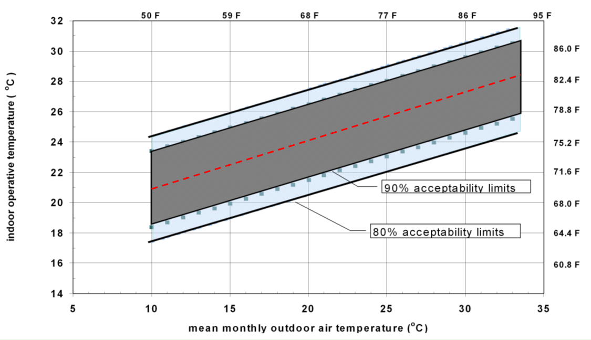
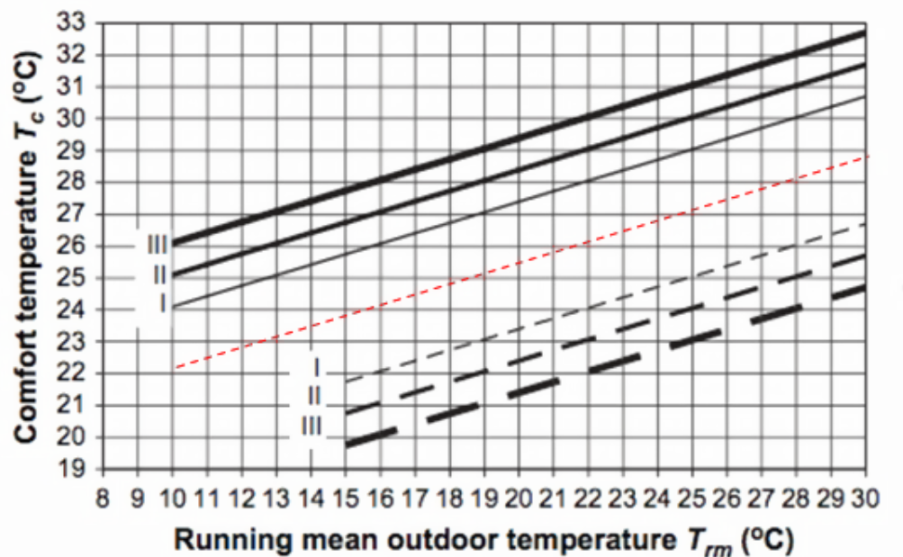

Thermostat Based-on Adaptive Thermal Comfort Models
================

 **Tianzhen Hong.**
 **Lawrence Berkeley National Laboratory**

 - Original Date: July 20, 2016
 

## Justification for New Feature ##

ASHRAE Standard 55-2010 and CEN 15251-2007 provide adaptive thermal comfort models for naturally ventilated buildings. The adaptive comfort models are getting used for mechanically cooled and ventilated buildings especially in hot climates to save energy. Users requested this feature.

## Introduction ##

ASHRAE Standard 55-2010, Thermal Environmental Conditions for Human Occupancy, introduces an adaptive thermal comfort model for spaces relying on occupants opening windows for natural ventilation and cooling. The adaptive comfort model relates the zone operative temperature setpoint to the outdoor air temperature, as a function defined in Figure 1.


Figure 1. Acceptable operative temperature ranges based on the adaptive thermal comfort model of ASHRAE Standard 55-2010

The European standard CEN 15251-2007 has a similar adaptive comfort model as shown in Figure 2.


Figure 2. Acceptable operative temperature ranges based on CEN15251-2007

Basically during summer time in hot climates, the zone thermostat setting can be higher than the traditional thermostat setting based on the Fanger comfort theory, which results in energy savings of HVAC systems. The adaptive comfort model was originally developed for naturally ventilated buildings, but is now recommended for use with mechanically cooled and ventilated buildings, which may go into effect in future editions of ASHRAE Standard 55.
This NFP will implement a new zone thermostat based on the adaptive comfort models in ASHRAE Standard 55-2010 as well as CEN 15251-2007.


## E-mail and Conference Call Conclusions ##

N/A

## Overview ##

The adaptive comfort model has been adopted in EnergyPlus as one of the thermal comfort models of the People object, as well as one control strategy to operate windows in the Airflow Network model. The existing code will be reused as much as possible. We propose to enhance the existing ThermostatSetpoint objects to indicate the applicability of the adaptive comfort model with three choices: 
- **None**. The adaptive comfort model is not applicable; 
- **AdaptiveASH55**. The central line of the ASHRAE Standard 55-2010 adaptive comfort model will be used as the zone operative temperature setpoint; and 
- **AdaptiveCEN15251**. The central line of the CEN Standard 15251-2007 adaptive comfort model will be used as the zone operative temperature setpoint. 

When the adaptive comfort model is selected, the thermostat setpoint temperature schedule will be overwritten with the calculated operative temperature based on the central line of the comfort model defined in ASHRAE 55-2010 or CEN 15251-2007. Such calculations have been implemented in EnergyPlus already. The ASHRAE adaptive comfort model is only applicable when the running average outdoor air temperature for the past 30 days is between 10.0 and 33.5°C; while the CEN 15251-2007 adaptive comfort model is only applicable when the running average outdoor air temperature for the past 7 days is between 10.0 and 30.0°C. 


## IDD Object (New) ##

N/A

## IDD Object(s) (Revised) ##

We propose to modify three existing IDD thermostat setpoint objects by adding a field to indicate which adaptive comfort model to use. The three thermostat setpoint objects are, ThermostatSetpoint:SingleCooling, ThermostatSetpoint:SingleHeatingOrCooling, and ThermostatSetpoint:DualSetpoint, which are referenced by the ZoneControl:Thermostat object.

```
ThermostatSetpoint:SingleCooling,
       \memo Used for a cooling only thermostat. The setpoint can be scheduled and varied throughout
       \memo the simulation but only cooling is allowed.
  A1 , \field Name
       \required-field
       \type alpha
       \reference ControlTypeNames
  A2 , \field Setpoint Temperature Schedule Name
       \type object-list
       \object-list ScheduleNames
  **A3** ; \field Adaptive Comfort Model Type
       \type choice
       \key None
       \key AdaptiveASH55
       \key AdaptiveCEN15251
       \default None
       \note the setpoint temperature schedule will be adjusted based on the selected adaptive comfort model type

ThermostatSetpoint:SingleHeatingOrCooling,
       \memo Used for a heating and cooling thermostat with a single setpoint. The setpoint can be
       \memo scheduled and varied throughout the simulation for both heating and cooling.
  A1 , \field Name
       \required-field
       \type alpha
       \reference ControlTypeNames
  A2 , \field Setpoint Temperature Schedule Name
       \type object-list
       \object-list ScheduleNames
  **A3** ; \field Adaptive Comfort Model Type
       \type choice
       \key None
       \key AdaptiveASH55
       \key AdaptiveCEN15251
       \default None
       \note the setpoint temperature schedule will be adjusted based on the selected adaptive comfort model type


ThermostatSetpoint:DualSetpoint,
       \memo Used for a heating and cooling thermostat with dual setpoints. The setpoints can be
       \memo scheduled and varied throughout the simulation for both heating and cooling.
  A1 , \field Name
       \required-field
       \type alpha
       \reference ControlTypeNames
  A2 , \field Heating Setpoint Temperature Schedule Name
       \type object-list
       \object-list ScheduleNames
  A3 , \field Cooling Setpoint Temperature Schedule Name
       \type object-list
       \object-list ScheduleNames
  **A4** ; \field Adaptive Comfort Model Type
       \type choice
       \key None
       \key AdaptiveASH55
       \key AdaptiveCEN15251
       \default None
       \note the cooling setpoint temperature schedule will be adjusted based on the selected adaptive comfort model type

```

## IO Ref ##
To be developed.

## EngRef ##
The Engineering Reference already described the adaptive comfort models for ASHRAE Standard 55-2010 and CEN 15251-2007.

## Example File and Transition Changes ##

A new example will be created using the simple DOE small office reference model to demonstrate the new feature.

## Proposed Report Variables ##
None

## Proposed additions to Meters ##
None

## Transition changes ##
N/A

## Other documents ##
N/A

## Reference ##

ASHRAE Standard 55-2010. Thermal environment conditions for human occupancy. ASHRAE, Atlanta.

EN 15251 (2007) Indoor environmental input parameters for design and assessment of energy performance of buildings- addressing indoor air quality, thermal environment, lighting and acoustics. CEN, Brussels.


